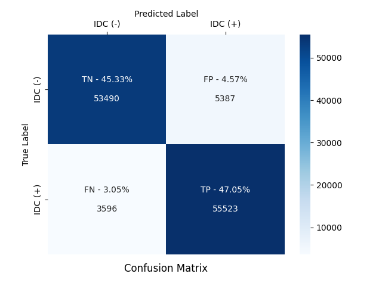
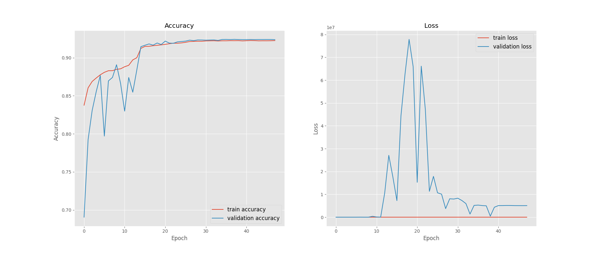

# Breast Cancer Detection

## Overview

The **Breast Cancer Detector** is a machine learning-based project designed to classify breast cancer cases as malignant or benign using medical data. The model leverages various classification algorithms to improve accuracy and aid in early cancer detection.

## Features

- Data preprocessing and feature selection
- Implementation of multiple machine learning models
- Performance evaluation using accuracy metrics
- Visualisation of results and insights

## Dataset

The project uses the **Wisconsin Breast Cancer Dataset** from the UCI Machine Learning Repository. The dataset contains features computed from digitised images of fine needle aspirate (FNA) of breast masses.

## Installation

### Prerequisites

Ensure you have the following installed:

- Python (>=3.7)
- Jupyter Notebook (optional, for exploration)
- Required dependencies (see `requirements.txt`)

### Setup

1. Clone the repository:
   ```sh
   git clone https://github.com/Arpeeet/Breast_Cancer_Detector.git
   cd Breast_Cancer_Detector
   ```
2. Install dependencies:
   ```sh
   pip install -r requirements.txt
   ```
3. Run the model training script:
   ```sh
   python train.py
   ```

## Usage

- Load and preprocess the dataset.
- Train the machine learning model using `train.py`.
- Evaluate performance using `evaluate.py`.
- Visualise the results through `visualise.py`.

## Model Performance

The project evaluates multiple models, such as:

- Logistic Regression
- Decision Tree
- Random Forest
- Support Vector Machine (SVM)
- K-Nearest Neighbors (KNN)

Performance is measured using metrics like accuracy, precision, recall, and F1-score.

### Results

\- | precision | recall | f1-score | support
--- | --- | --- | --- | ---
0 | 0.94 | 0.91 | 0.92 | 58877
1 | 0.91 | 0.94 | 0.93 | 59119

<br>
<br>

### Confusion Matrix



<br>
<br>

### Training & Validation Accuracy & Loss Graphs




## Contributing

Contributions are welcome! Feel free to fork the repository, create a feature branch, and submit a pull request.

## License

This project is licensed under the GPL-3.0 License. See the [LICENSE](LICENSE) file for details.


